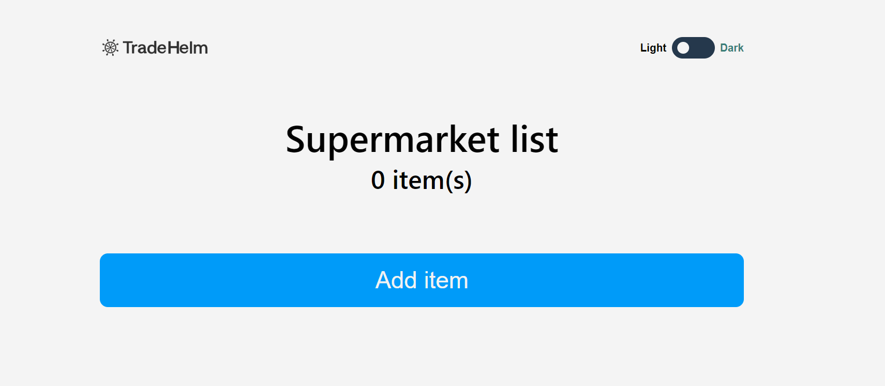

# Esto es un titulo
## Esto es un H2
### Esto es un h3

h1 h2 h3

## Tecnologias que use en el proyecto
- React
- Css
- Figma

## para que funcione mi proyecto siga estos comandos
1. npm install
2. npm start
3. npm test

para escribir negrita ***en negrita***

---
___


```html
    <h1>codigo de html</h1>
```

```javascript
    console.log('estos es codigo de javascript')
```

```python
    print('pueden escribir codigo de esta manera')
```

https://www.google.com/

[visite my web](https://www.google.com/)


